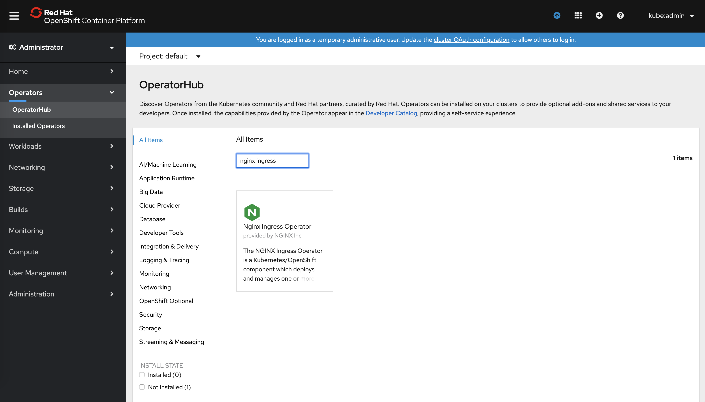
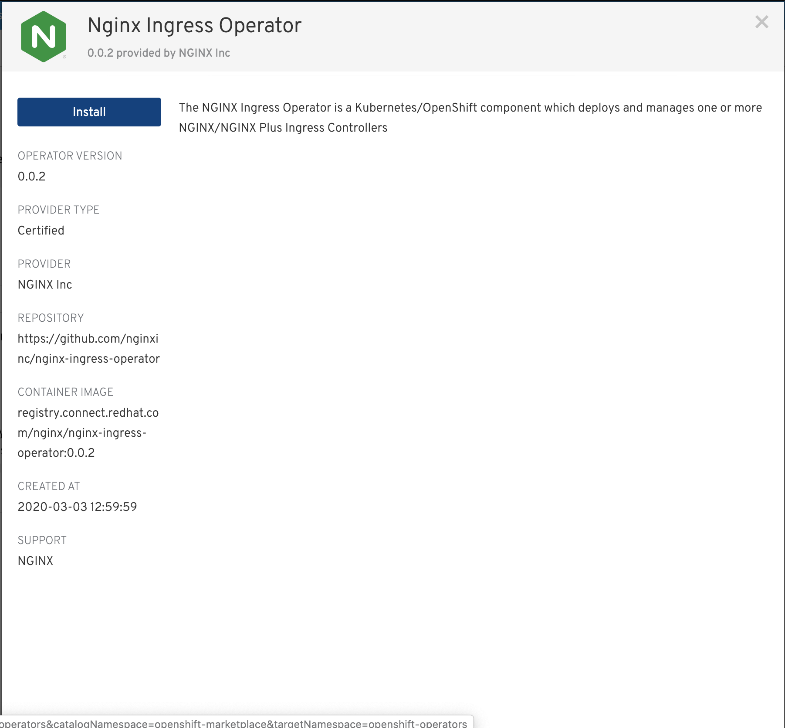
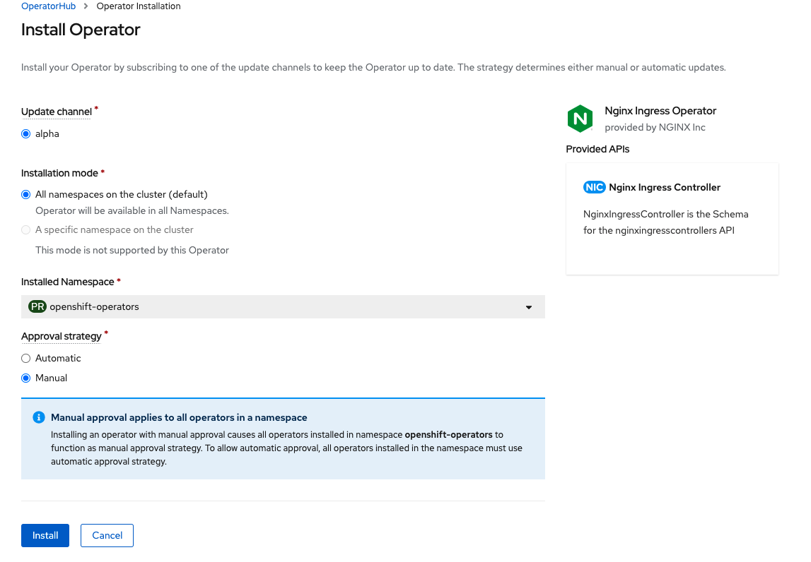
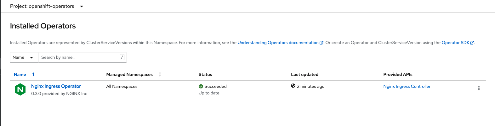

# Installation in an Openshift cluster the OLM

This installation method is the recommended way for Openshift users. **Note**: Openshift version must be 4.2 or higher.

The NGINX Ingress Operator is a [RedHat certified Operator](https://connect.redhat.com/en/partner-with-us/red-hat-openshift-operator-certification).

1. In the Openshift dashboard, click `Operators` > `Operator Hub` in the left menu and use the search box to type `nginx ingress`:

1. Click the `NGINX Ingress Operator` and click `Install`:

1. Click `Subscribe`:

Openshift will install the NGINX Ingress Operator:

You can now deploy the NGINX Ingress Controller instances following the [examples](../examples).